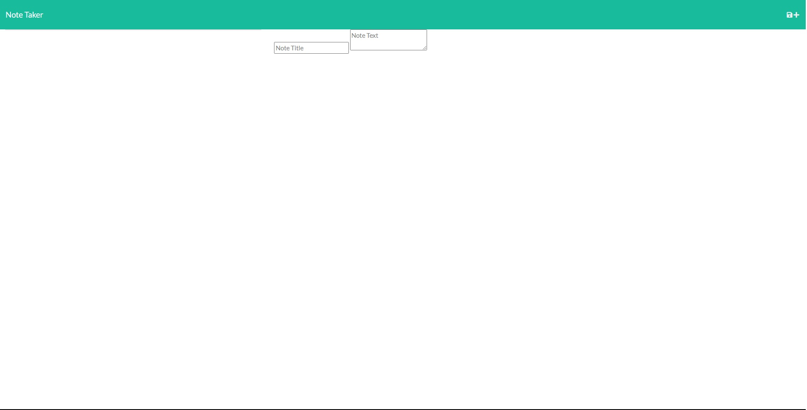

# Note Taker

Deployed Application: https://damp-eyrie-05003.herokuapp.com/

GitHub Repository: https://github.com/Ericcrain77/note-taker

## Table of Contents
* [Description](#description)
* [Screenshots](#Screenshots)
* [Questions](#questions)

## Description
Note Taker is an application designed to write and save notes. This application uses an Express.js back end and savs and retrieves note data from a JSON file.

## Screenshots
Index Page

Notes Page

## Questions
Reach out to me using my [Github account](https://github.com/Ericcrain77) or my [email](ericcrain77@gmail.com).